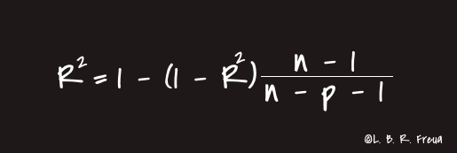

**[UNDER DEVELOPMENT]**

### Summary

- [1. Applications of `Machine Learning`](#1-applications-of-machine-learning)
- [2. Difference between AI, ML and DL](#2-difference-between-ai-ml-and-dl)
  - [2.1. **Artificial Intelligence**](#21-artificial-intelligence)
  - [2.2. **Machine Learning**](#22-machine-learning)
  - [2.3. **Deep Learning**](#23-deep-learning)
- [3. Data Preprocessing](#3-data-preprocessing)
- [4. Regression](https://github.com/Leonardofreua/ML-and-DataScience-in-practice/tree/master/Regression)
- [5. How to choose the most suitable models](#5-how-to-choose-the-most-suitable-models)
  - [5.1. Evaluating Regression Models Performance](#51-evaluating-regression-models-performance)
    - [5.1.1. R Squared](#511-r-squared)

# 1. Applications of `Machine Learning`

Currently, almost everything we use is already using **Machine Learning (ML)** in some way, for example: whenever you post on **Facebook**, it already knows who your friends are in the photo and automatically tags them, this implies another application which is **Recognition Facial** that is being widely adopted. This is an example that almost everyone has seen, but we can mention others, such as: the **X-Box Kinect**, which analyzes your actions and reproduces them in the game you are playing and the name of the algorithm used in this scenario isc alled the **Forest Random**, we can also quote **Netflix** with it's system of recommendations for films and series, which learns from the informations provided, such as the time you spend watching a specific program, which were marked with like or deslike, **Virtual Stores** also use the Machine Learning **to offer new products** according to your consumption or visualizations, the keyboard of your SmartPhone learns while you type your messages or surveys, **Virtual Reality (VR)** glasses, Machine Learning is also use to save lives, helping to detect cancer and making new drugs, vaccines and other things that would take a long time if only humans wre analyzed.

I can cite many other examples, but I suggest paying close attention to the behavior of the tools you use on a daily basis and if you notice that it seems to know you very well or that it makes very accurate predictions, this will probably indicate that this tool is using Machine Learning in some part of it's functioning.

# 2. Difference between AI, ML and DL

There is often a difficulty in understanding the differences between Artificial Intelligence (AI), Machine Learning (ML) and Deep Learning (DL). Terms that are not recent, but that have gained greater popularity in the last decade.

  

  
## 2.1. **Artificial Intelligence**

Artificial Intelligence is a term that was created in 1955 and that can be interpreted basically as the name suggests, that is, **the incorporation of human intelligence in machines**.

So, whenever a machine performs a task, which has been implemented with a set of instructions (algorithms), we call this "Intelligent" behavior Artificial Intelligence. There we can concluded that all machines that perform some tasks through algorithms are "equipped" with Artificial Intelligence. 

If it is still difficult to observe this, we can cite some examples very close to us, such as: our fridges, washing machines, SmartPhones, car or house alarms, among thousands of other devices that we use in our day today.

## 2.2. **Machine Learning**

Again, as the name suggests, it is the ability of machines to learn and we can interpret this as a way of instructing machines with teachings so that they can perform specific tasks.

We can do this by providing data so that the machine understands the patterns (training) and from there makes decisions based on what it has learned. It is like teaching certain taks to a child, you explain to him how to perform a certain task with examples (data), he performs that task several times to really learn (training) and, depending on this performance, you help him so that he can perform the task more efficiently (accurately).

## 2.3. **Deep Learning**

Deep Learning is a subset of the Machine Learning universe, we can interpret it as the next evolution of Machine Learning itself.

DL is inspired by the functioning of the human brain in relation to pattern processing.

Just as our brain identifies patterns and classifies them, Deep Learning algorithms are implemented to behave in the same way.

Comparing the functioning of Deep Learning and Machine Learning, we can see that while the DL can discover the features that must be applied in a classification, the ML needs that these features are provided manually.

# 3. Data Preprocessing

[:snake: Notebook code](https://github.com/Leonardofreua/Machine-Learning-A-Z-Python-and-R-in-Data-Science/blob/master/Data%20Preprocessing/Python/data_preprocessing_tools.ipynb) | [:chart_with_upwards_trend: R code](https://github.com/Leonardofreua/Machine-Learning-A-Z-Python-and-R-in-Data-Science/blob/master/Data%20Preprocessing/R/data_preprocessing_template.r)

---

In this stage of data Preprocessing, we will start a Notebook with the following approaches:

* Importing the Libraries
* Importing the Dataset
* Taking care of Missing Data:
  > We perform this procedure by taking the empty data and replacing it with the average.
* Enconding Categorical Data: 
  > Encoding is necessary at this point, because as there is no relationship between country names, we do not want an incorrect interpretation made by the model, which would causa inaccurate correlattions and consequently impact it's accuracy. So, the encoding methods applied here is **[One Hot Encoding](https://en.wikipedia.org/wiki/One-hot)** and to **Purchased** column we applied the **[Label Encoding](https://scikit-learn.org/stable/modules/generated/sklearn.preprocessing.LabelEncoder.html)**.

  > *For more about encondig methods, see the following link:* [All about Categorical Variable Encoding](https://towardsdatascience.com/all-about-categorical-variable-encoding-305f3361fd02) 
  *For more about Categorial variable, see the following link:* [Categorical Variable](https://en.wikipedia.org/wiki/Categorical_variable)
* Spliting the dataset into the **Training set** and **Test Set**:
  > In this step, we apply the Feature Scaling after splitting the data set into two other sets, which are: **Testing** and **Training**. This is because the Test data set is composed of new data, which has not yet been observed. Therefore, these cannot be mixed with the Training data set. 
  > The use of any data from the Test suite before or during training is a potential bias in assessing performance.
* Feature Scalling:
  > Feature scaling is the process of scaling the values of features in a dataset so that they proportionally contribute to the distance calculation. The two most commonly used feature scaling techniques are Standardisation (or Z-Score Normalisation) and Min-Max scaling.
  
  > **Normalisation**: Is recommended when have a normal distribuition on most of your resources.
  
  

    
  

  > **Standardisation**: We use this approach in most situations, as it always provides good performance towards standard deviation.

  

    
  

  **References:** 
  [Feature Scaling and Normalisation in a nutshell](https://medium.com/@giorgosmyrianthous/feature-scaling-and-normalisation-in-a-nutshell-5319af86f89b) 
  [Euclidian Distance](https://en.wikipedia.org/wiki/Euclidean_distance)

# [4. Regression](https://github.com/Leonardofreua/ML-and-DataScience-in-practice/tree/master/Regression)

# 5. How to choose the most suitable models

With so many models available, it is normal ot be in doubt about which to select for each situation. For this, we will use the **R²** method to evaluate the performance of our model, so we can be sure if we are making the most appropriate choice.

<table style="width:60% !important; margin: auto;">
    <tr>
        <th>Multiple Linear Regression</th>
        <td><a href="https://github.com/Leonardofreua/ML-and-DataScience-in-practice/blob/master/Model%20Selection/Multiple%20Linear%20Regression/Python/multiple_linear_regression.ipynb">🐍 Notebook code</a></td>
        <td>📈 R code</td>
    </tr>
    <tr>
        <th>Polynomial Linear Regression</th>
        <td><a href="https://github.com/Leonardofreua/ML-and-DataScience-in-practice/blob/master/Model%20Selection/Polynomial%20Linear%20Regression/Python/polynomial_regression.ipynb">🐍 Notebook code</a></td>
        <td>📈 R code</td>
    </tr>
    <tr>
        <th>Support Vector Regression (SVR)</th>
        <td><a href="https://github.com/Leonardofreua/ML-and-DataScience-in-practice/blob/master/Model%20Selection/Support%20Vector%20Regression%20(SVR)/Pyhton/support_vector_regression.ipynb">🐍 Notebook code</a></td>
        <td>📈 R code</td>
    </tr>
    <tr>
        <th>Decision Tree Regression</th>
        <td><a href="https://github.com/Leonardofreua/ML-and-DataScience-in-practice/blob/master/Model%20Selection/Decision%20Tree%20Regression/Python/decision_tree_regression.ipynb">🐍 Notebook code</a></td>
        <td>📈 R code</td>
    </tr>
    <tr>
        <th>Random Forest Regressio</th>
        <td><a href="https://github.com/Leonardofreua/ML-and-DataScience-in-practice/blob/master/Model%20Selection/Random%20Forest%20Regression/Python/random_forest_regression.ipynb">🐍 Notebook code</a></td>
        <td>📈 R code</td>
    </tr>
  </table>

---
**:pushpin: Topics covered:**

- [5.1. Evaluating Regression Models Performance](#51-evaluating-regression-models-performance)
  - [5.1.1. R Squared](#511-r-squared)

---

## 5.1. Evaluating Regression Models Performance

The **coefficient of determination** denoted R² and pronounced "**R squared**", is the proportion of the variance in the dependent variable that is predictable from the independent variable(s).

The R² varies between 0 and 1, sometimes being expressed in percentage terms. In this case, it express the amount of variance in the data that is explained by the linear model. Thus, the higher the R², the more explanatory the linear model is, that is, the better it fits the sample. For example, an **R² = 0.8234** means that the linear model explains **82.34%** of the variance of the dependent variable from the regressors (independent variables) included in that linear model.

### 5.1.1. R Squared

We will use a more efficient version of R², which is the **adjusted R²**. And the reason for this is because by including numerous variables, even though they have very little explanatory power over the dependent variable, <ins>they will increase the value of R²</ins>. This encourages the indiscriminate inclusion of variables, which may increase the R² superficially, with variables that are not relevent to our predictions. To combat this trend, we will use the **adjusted R², which penalizes the inclusion of little explanatory regressors.

  

> * **p** = where p is the total number of explanatory variables in the model (not including the constant term);
> * **n** = n is the sample size;

**References:** 
[Coefficient of determination](https://en.wikipedia.org/wiki/Coefficient_of_determination#Adjusted_R2)