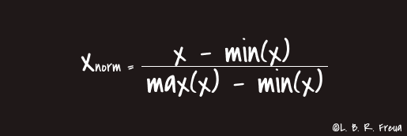
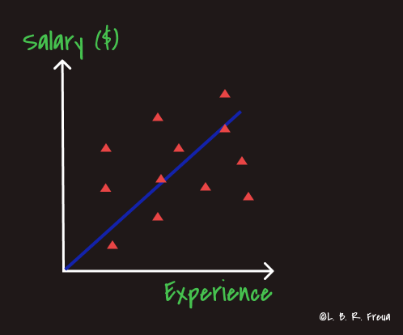
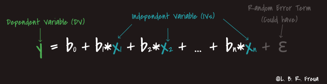
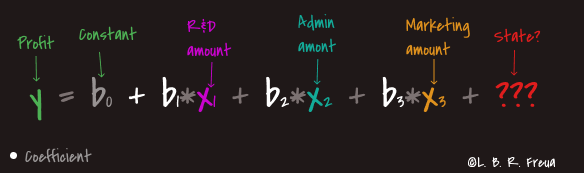
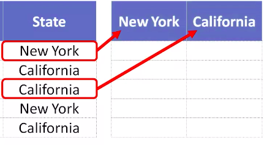
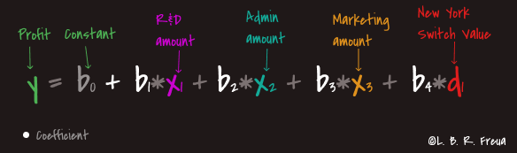
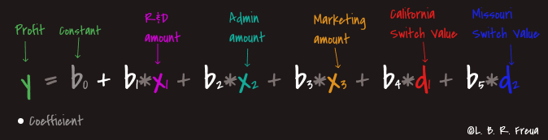

### Summary

- [1. Applications of `Machine Learning`](#1-applications-of-machine-learning)
- [2. Difference between AI, ML and DL](#2-difference-between-ai-ml-and-dl)
  - [2.1. **Artificial Intelligence**](#21-artificial-intelligence)
  - [2.2. **Machine Learning**](#22-machine-learning)
  - [2.3. **Deep Learning**](#23-deep-learning)
- [3. Data Preprocessing](#3-data-preprocessing)
- [4. Regression](#4-regression)
  - [4.1. Simple Linear Regression](#41-simple-linear-regression)
    - [4.1.1. Definition](#411-definition)
    - [4.1.2. Aplication examples](#412-aplication-examples)
    - [4.1.3. How to find the best fit line?](#413-how-to-find-the-best-fit-line)
  - [4.2. Multiple Linear Regression](#42-multiple-linear-regression)
    - [4.2.1. Definition](#421-definition)
    - [4.2.2. Aplication examples](#422-aplication-examples)
    - [4.2.3. Assumptions of multiple linear regression](#423-assumptions-of-multiple-linear-regression)
    - [4.2.4. Dummy Variables](#424-dummy-variables)
    - [4.2.5. Dummy Variable Trap](#425-dummy-variable-trap)
    - [4.2.6. Building a Model with the right methods](#426-building-a-model-with-the-right-methods)

# 1. Applications of `Machine Learning`

Currently, almost everything we use is already using **Machine Learning (ML)** in some way, for example: whenever you post on **Facebook**, it already knows who your friends are in the photo and automatically tags them, this implies another application which is **Recognition Facial** that is being widely adopted. This is an example that almost everyone has seen, but we can mention others, such as: the **X-Box Kinect**, which analyzes your actions and reproduces them in the game you are playing and the name of the algorithm used in this scenario isc alled the **Forest Random**, we can also quote **Netflix** with it's system of recommendations for films and series, which learns from the informations provided, such as the time you spend watching a specific program, which were marked with like or deslike, **Virtual Stores** also use the Machine Learning **to offer new products** according to your consumption or visualizations, the keyboard of your SmartPhone learns while you type your messages or surveys, **Virtual Reality (VR)** glasses, Machine Learning is also use to save lives, helping to detect cancer and making new drugs, vaccines and other things that would take a long time if only humans wre analyzed.

I can cite many other examples, but I suggest paying close attention to the behavior of the tools you use on a daily basis and if you notice that it seems to know you very well or that it makes very accurate predictions, this will probably indicate that this tool is using Machine Learning in some part of it's functioning.

# 2. Difference between AI, ML and DL

There is often a difficulty in understanding the differences between Artificial Intelligence (AI), Machine Learning (ML) and Deep Learning (DL). Terms that are not recent, but that have gained greater popularity in the last decade.

  

  
## 2.1. **Artificial Intelligence**

Artificial Intelligence is a term that was created in 1955 and that can be interpreted basically as the name suggests, that is, **the incorporation of human intelligence in machines**.

So, whenever a machine performs a task, which has been implemented with a set of instructions (algorithms), we call this "Intelligent" behavior Artificial Intelligence. There we can concluded that all machines that perform some tasks through algorithms are "equipped" with Artificial Intelligence. 

If it is still difficult to observe this, we can cite some examples very close to us, such as: our fridges, washing machines, SmartPhones, car or house alarms, among thousands of other devices that we use in our day today.

## 2.2. **Machine Learning**

Again, as the name suggests, it is the ability of machines to learn and we can interpret this as a way of instructing machines with teachings so that they can perform specific tasks.

We can do this by providing data so that the machine understands the patterns (training) and from there makes decisions based on what it has learned. It is like teaching certain taks to a child, you explain to him how to perform a certain task with examples (data), he performs that task several times to really learn (training) and, depending on this performance, you help him so that he can perform the task more efficiently (accurately).

## 2.3. **Deep Learning**

Deep Learning is a subset of the Machine Learning universe, we can interpret it as the next evolution of Machine Learning itself.

DL is inspired by the functioning of the human brain in relation to pattern processing.

Just as our brain identifies patterns and classifies them, Deep Learning algorithms are implemented to behave in the same way.

Comparing the functioning of Deep Learning and Machine Learning, we can see that while the DL can discover the features that must be applied in a classification, the ML needs that these features are provided manually.

# 3. Data Preprocessing

In this stage of data Preprocessing, we will start a Notebook with the following approaches:

[Notebook code](https://github.com/Leonardofreua/Machine-Learning-A-Z-Python-and-R-in-Data-Science/blob/master/Data%20Preprocessing/Python/data_preprocessing_tools.ipynb) | [R code](https://github.com/Leonardofreua/Machine-Learning-A-Z-Python-and-R-in-Data-Science/blob/master/Data%20Preprocessing/R/data_preprocessing_template.r)

* Importing the Libraries
* Importing the Dataset
* Taking care of Missing Data:
  > We perform this procedure by taking the empty data and replacing it with the average.
* Enconding Categorical Data: 
  > Encoding is necessary at this point, because as there is no relationship between country names, we do not want an incorrect interpretation made by the model, which would causa inaccurate correlattions and consequently impact it's accuracy. So, the encoding methods applied here is **[One Hot Encoding](https://en.wikipedia.org/wiki/One-hot)** and to **Purchased** column we applied the **[Label Encoding](https://scikit-learn.org/stable/modules/generated/sklearn.preprocessing.LabelEncoder.html)**.

  > *For more about encondig methods, see the following link:* [All about Categorical Variable Encoding](https://towardsdatascience.com/all-about-categorical-variable-encoding-305f3361fd02) 
  *For more about Categorial variable, see the following link:* [Categorical Variable](https://en.wikipedia.org/wiki/Categorical_variable)
* Spliting the dataset into the **Training set** and **Test Set**:
  > In this step, we apply the Feature Scaling after splitting the data set into two other sets, which are: **Testing** and **Training**. This is because the Test data set is composed of new data, which has not yet been observed. Therefore, these cannot be mixed with the Training data set. 
  > The use of any data from the Test suite before or during training is a potential bias in assessing performance.
* Feature Scalling:
  > Feature scaling is the process of scaling the values of features in a dataset so that they proportionally contribute to the distance calculation. The two most commonly used feature scaling techniques are Standardisation (or Z-Score Normalisation) and Min-Max scaling.
  
  > **Normalisation**: Is recommended when have a normal distribuition on most of your resources.
  
  

    
  

  > **Standardisation**: We use this approach in most situations, as it always provides good performance towards standard deviation.

  

    
  

  **References:** 
  [Feature Scaling and Normalisation in a nutshell](https://medium.com/@giorgosmyrianthous/feature-scaling-and-normalisation-in-a-nutshell-5319af86f89b) 
  [Euclidian Distance](https://en.wikipedia.org/wiki/Euclidean_distance)

# 4. Regression

## 4.1. Simple Linear Regression

[Notebook code](https://github.com/Leonardofreua/Machine-Learning-A-Z-Python-and-R-in-Data-Science/blob/master/Regression/Simple%20Linear%20Regression/Python/simple_linear_regression.ipynb) | [R code](https://github.com/Leonardofreua/Machine-Learning-A-Z-Python-and-R-in-Data-Science/blob/master/Regression/Simple%20Linear%20Regression/R/simple_linear_regression.R)

---
**Topics covered:**

- [4.1.1. Definition](#411-definition)
- [4.1.2. Aplication examples](#412-aplication-examples)
- [4.1.3. How to find the best fit line?](#413-how-to-find-the-best-fit-line)

---

### 4.1.1. Definition

*Is a statiscal method for obtaining a formula to predict values of one variable from another where there is a casual relationship between the two variables.*

Simple Linear Regression makes predictions of the **dependent variable (Y)** based on the value of the **independent variable (X)**.

 

  

**Equation**:

  

  <em>Font: [Simple linear regression Equation](https://rstudio-pubs-static.s3.amazonaws.com/401724_c38918314a8d479ab351f4f83a8fa284.html)</em>

> **Random Error term (ε)** is used to represent **Irreducible Errors**, some of which are inherent to the nature of the problem.

### 4.1.2. Aplication examples

* Study how the parent's height may influence their children's height;
* Estimate thhe price of a house depending on it's surface;
* Predict the unemployment level for different ages;
* Approximate the grades attained in a subject as a function of the number of study hours per week;
* Forecast the execution time of a program depending on the speed of the processor.

### 4.1.3. How to find the best fit line?

The center line represents the best fit line or the Simple Linear regression model. Then, the **Red Cross** marked in the image, represents a person who has for example: 10 years of experience and earns the US $ 100,000. Already, the **Green Cross** shows us where this person should be acordding to his experience. Therefore, the Green Line between the two crosses is the difference between what he is really earning and what he should be.

Now, to better adjust this line, add the values of the red and green cross, then square the result, and find the minimum, As depicted in the image:

 

  

**References**: 
[Simple linear regression](http://www.statstutor.ac.uk/resources/uploaded/slregression.pdf) 
[Statistics II - Lesson 4. Simple linear regression](http://halweb.uc3m.es/esp/Personal/personas/aarribas/eng/docs/estII/tema4_eng.pdf)

## 4.2. Multiple Linear Regression

[Notebook code](https://github.com/Leonardofreua/ML-and-DataScience-in-practice/blob/master/Regression/Multiple%20Linear%20Regression/Python/multiple_linear_regression.ipynb) | [R code](https://github.com/Leonardofreua/ML-and-DataScience-in-practice/blob/master/Regression/Multiple%20Linear%20Regression/R/multiple_linear_regression.R)

---
**Topics covered:**

- [4.2.1. Definition](#421-definition)
- [4.2.2. Aplication examples](#422-aplication-examples)
- [4.2.3. Assumptions of multiple linear regression](#423-assumptions-of-multiple-linear-regression)
- [4.2.4. Dummy Variables](#424-dummy-variables)
- [4.2.5. Dummy Variable Trap](#425-dummy-variable-trap)
- [4.2.6. Building a Model with the right methods](#426-building-a-model-with-the-right-methods)

---

### 4.2.1. Definition

*Multiple linear regression is used to estimate the relationship between two or more independent variables and one dependent variable.*

You can use multiple linear regression when you want to know:

* How strong the relationship is between two or more independent variables and one dependent variable (e.g. how rainfall, temperature, and amount of fertilizer added affect crop growth);
* The value of the dependent variable at a certain value of the independent variables (e.g. the expected yield of a crop at certain levels of rainfall, temperature, and fertilizer addition).

**Equation**:

  

> * **y** = the predicted value of the dependent variable;
> * **B0** = the y-intercept (value of y when all other parameters are set to 0);
> * **B1*X1** = the regression coefficient (B1) of the first independent variable (X1) (a.k.a. the effect that increasing the value of the independent variable has on the predicted y value);
> * **…** = do the same for however many independent variables you are testing;
> * **Bn*Xn** = the regression coefficient of the last independent variable;
> * **ε** (could have) = model error (a.k.a. how much variation there is in our estimate of y).

### 4.2.2. Aplication examples

* The selling price of a house can depend on the desirability of the location, the number of bedrooms, the number of bathrooms, the year the house was built, the square footage of the lot and a number of other factors;
* The height of a child can depend on the height of the mother, the height of the father, nutrition, and environmental factors.

### 4.2.3. Assumptions of multiple linear regression

* **Homogeneity of variance (homoscedasticity)**: the size of the error in our prediction doesn’t change significantly across the values of the independent variable.

* **Independence of observations**: the observations in the dataset were collected using statistically valid methods, and there are no hidden relationships among variables.

  In multiple linear regression, it is possible that some of the independent variables are actually correlated with one another, so it is important to check these before developing the regression model. If two independent variables are too highly correlated (r2 > ~0.6), then only one of them should be used in the regression model.

* **Normality**: Multple regression assumes that the residuals are normally distributed.

  

  <em>Font: [Going Deeper into Regression Analysis with Assumptions, Plots & Solutions](https://www.analyticsvidhya.com/blog/2016/07/deeper-regression-analysis-assumptions-plots-solutions/)</em>

* **Linearity**: the line of best fit through the data points is a straight line, rather than a curve or some sort of grouping factor.

### 4.2.4. Dummy Variables

To understand how dummy variables work, let's take into account the information below:

So basically the information that we have is the profit of each company or each startup and it's expenses with R&D, administration, marketing and the state in which it is located. Thus, on a given day, the Venture Capital fund wanted to know if there are any correlations between profit and the months spent in Administration, Marketing and R&D and also with the stage at which the company operates. They also want to predict profit, so profit is our dependent variable (**Green column**) and the rest of the columns (**Blue**) are all independent variables.

So, we need to do a Multiple Linear Regression to get those answers. Our equation will be formed according to the indicated values, as we can see below:

  

*Allocating values in the equation:*

  

After allocating all values, we come across the **State** column, which refers to a type of the **categorical variable** and in order to be able to add it to our equation, we need to create **Dummy Variables**. 

To start the Dummy Variables creating, we need to through the State column and find all the different categories we have. In this case, we have **two**:

  

So for each category found, we need to create a new column for each one:

  

In this way, we are **expanding** our dataset and here comes the fun part, in which we need to fill in these columns.

For that, we need to find all the lines where the state of **New York** is present and add the number **1** in the corresponding lines, in the others put **0**:

  

For **California**, we need to do **same thing**:

  

This way we finish our changes and our data set has these new columns that are called **Dummy Variables**.

Now it's easy to proceed with the construction of our Multiple Linear Regression model. Instead of using the old **States** column, we will use our new columns:

  

In fact, we will only need to use the **New York** column, as it already provides us with all the information we need, as it's enough to say immediately if the company is located in New York **(1)**, if it's not in California **(0)**. But it is important to note that **all information in the data set WILL BE PRESERVED**:

  

Finally, our equation will look like this:

  

In [Dummy Variable Trap](#425-dummy-variable-trap) we wil explain the reason for not using the column for the state California.

### 4.2.5. Dummy Variable Trap

The Dummy Variable trap is a scenario in which the independent variables are multicollinear — a scenario in which two or more variables are highly correlated; in simple terms one variable can be predicted from the others.

In order not to fall into this trap, we will always declare in our equation, **one less** Dummy Variable (n - 1) than the number of existing categories (n).

[Using the previous scenario](#424-dummy-variables) where there were the **New York** and **California** columns, we don't need the California column, because with it present in our equation, **we would have duplicate categories**. Therefore, only the **New York** column is enough.

**Another example:**

If we had one more state in our dataset, for example: **Missouri**. After that, our dataset would look like this:

| New York | California | Missouri |
| :------- | :--------: | -------: |
| 1        |     0      |        0 |
| 0        |     1      |        1 |
| 0        |     1      |        0 |
| 1        |     0      |        0 |
| 0        |     0      |        1 |

Analysing the table above, we can see that the **California** and **Missouri** columns provide us with all necessary information. So we can disregard the column referring to **New York**:

| California | Missouri |
| :--------- | -------: |
| 0          |        0 |
| 1          |        1 |
| 1          |        0 |
| 0          |        0 |
| 0          |        1 |

And our equation  would be presented as follows:

  

### 4.2.6. Building a Model with the right methods

Due to the possibility that there are many variables involved in our model, these can negatively impact accuracy. Therefore, we need to apply some methods to ensure good accuracy:

> **Note**:
> SL = [Statistical Significance](https://towardsdatascience.com/statistical-significance-hypothesis-testing-the-normal-curve-and-p-values-93274fa32687) 

* **Backward Elimination**:  
  > **Step 1**: Select a significance level to stay in the model (e.g. SL = 0.05);

  > **Step 2**: Fit the full mode with all possible predictors;
  >
  > **Step 3**: Consider the predictor with the **highest** P-Value. If P > SL, go to **STEP 4**, otherwise go to FIN (*Your model is ready*);
  >
  > **Step 4**: Remove the predictor;
  >
  > **Step 5**: Fit model without this variable. So, return to the **Step 3**.

* **Forward Selection**:
  > **Step 1**: Select a significance level to stay in the model (e.g. SL = 0.05);
  >
  > **Step 2**: Fit all simple regression models **y ~ Xn** . Select the one with the lowest P-value (quite laborious);
  >
  > **Step 3**: Keep this variable and fit all possible models with one extra predictor added to the one(s) you already have;
  >
  > **Step 4**: Consider the predictor with the <u>lowest</u> P-value. If P > SL, go to **STEP 3**, otherwise go to FIN (*Keep the previous model*).

 * **Bidirectional Elimination**:
  > **Step 1**: Select a significance level to enter and to stay in the model e.g.: *SL***ENTER** = 0.05, *SL***STAY** = 0.05;
  >
  > **Step 2**: Perform the next step of Forward Selection (new variabes must have: P < *SL***ENTER** to enter);
  >
  > **Step 3**: Perform ALL steps of Backward Elimination (old variabes must have: P < *SL***STAY** to stay);
  >> Then, go back to **step 2** and repeat this cycle between **step 2** and **step 3** until no new variables can enter and no old variables can exit.
  >
  > **Step 4**: No new variables can enter and no old variables can exit, FIN (Your model is ready).

**References**: 
[An introduction to multiple linear regression](https://www.scribbr.com/statistics/multiple-linear-regression/) 
[Multiple Linear Regression](http://mezeylab.cb.bscb.cornell.edu/labmembers/documents/supplement%205%20-%20multiple%20regression.pdf) 
[Statistical Significance Explained](https://towardsdatascience.com/statistical-significance-hypothesis-testing-the-normal-curve-and-p-values-93274fa32687)
